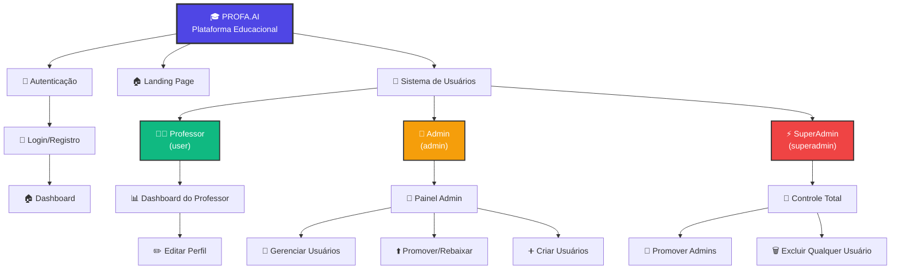
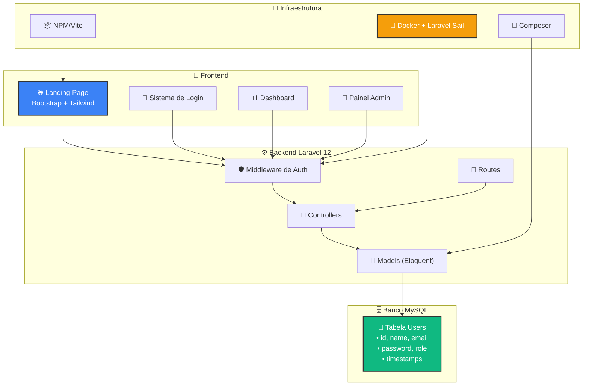

# 🎓 PROFA.AI - Assistente Inteligente para Professores

<div align="center">
  
  
  
  
  
</div>

<br>

<div align="center">
  <h3>🚀 Micro SaaS Educacional - Otimize o planejamento pedagógico com Inteligência Artificial</h3>
  <p><em>Transforme a maneira como você planeja suas aulas e crie conteúdo educacional personalizado</em></p>
</div>

---

## 📋 Sobre o Projeto

**PROFA.AI** é uma plataforma web desenvolvida especificamente para **professores da educação básica** que desejam otimizar seu tempo de planejamento pedagógico. A ferramenta utiliza inteligência artificial para gerar automaticamente planos de aula, atividades e avaliações personalizadas, permitindo que os educadores foquem mais na didática e no relacionamento com seus alunos.

### 🎯 Objetivos Principais

- ⏰ **Economia de Tempo**: Redução de horas no planejamento diário e semanal
- 🤖 **IA Educacional**: Geração automática de conteúdo pedagógico personalizado  
- 👥 **Foco na Didática**: Mais tempo para interação e inovação em sala de aula
- 📚 **Qualidade Pedagógica**: Conteúdo alinhado às necessidades específicas de cada turma

---

## 📊 Fluxo do Sistema



## 🏗️ Arquitetura Técnica



---

## ✨ Funcionalidades

### 🔐 Sistema de Autenticação
- [x] **Login/Registro** seguro e intuitivo
- [x] **Sistema de Roles** (Usuário, Admin, Superadmin)
- [x] **Edição de perfil** personalizada
- [x] **Recuperação de senha** (planejado)

### 👑 Painel Administrativo
- [x] **Gerenciamento completo de usuários**
- [x] **Sistema de promoção/rebaixamento** de permissões
- [x] **Dashboard estatístico** com métricas
- [x] **Controle de acesso** hierárquico
- [x] **Alternação de visualização** admin/usuário

### 🎨 Interface e UX
- [x] **Design moderno e responsivo**
- [x] **Landing page** explicativa e atrativa
- [x] **Navegação intuitiva** para professores
- [x] **Tema educacional** com cores e ícones apropriados

### 🚧 Em Desenvolvimento
- [ ] **Geração de planos de aula** com IA
- [ ] **Criação de atividades** personalizadas
- [ ] **Sistema de avaliações** automatizado
- [ ] **Export para PDF** dos materiais
- [ ] **Integração com ChatGPT/OpenAI**
- [ ] **Biblioteca de templates** educacionais

---

## 🛠️ Tecnologias Utilizadas

### Backend
- **[Laravel 12.x](https://laravel.com/)** - Framework PHP moderno e elegante
- **[PHP 8.2+](https://php.net/)** - Linguagem de programação server-side
- **[MySQL 8.0+](https://mysql.com/)** - Sistema de gerenciamento de banco de dados
- **[Eloquent ORM](https://laravel.com/docs/eloquent)** - Mapeamento objeto-relacional

### Frontend
- **[Bootstrap 5.3.3](https://getbootstrap.com/)** - Framework CSS responsivo
- **[Tailwind CSS 3.x](https://tailwindcss.com/)** - Framework CSS utility-first
- **[Bootstrap Icons](https://icons.getbootstrap.com/)** - Biblioteca de ícones
- **[Blade Templates](https://laravel.com/docs/blade)** - Engine de templates do Laravel

### Ferramentas de Desenvolvimento
- **[Composer](https://getcomposer.org/)** - Gerenciador de dependências PHP
- **[Laravel Sail](https://laravel.com/docs/sail)** - Ambiente de desenvolvimento Docker
- **[Vite](https://vitejs.dev/)** - Build tool e bundler
- **[Laravel Pint](https://laravel.com/docs/pint)** - Code style fixer

---

## 🚀 Instalação e Configuração

### 🐳 **Instalação com Docker (Recomendado)**

#### Pré-requisitos
- Docker Desktop
- WSL2 (para Windows) ou Docker nativo (Linux/Mac)

#### Passo a Passo - Docker

1. **Clone o repositório**
```bash
git clone https://github.com/seu-usuario/profa-ai.git
cd profa-ai
```

2. **Configure o ambiente**
```bash
cp .env.example .env
```

3. **Suba os containers**
```bash
# Primeira execução (vai buildar as imagens)
./vendor/bin/sail up -d

# Ou usando o alias
alias sail='./vendor/bin/sail'
sail up -d
```

4. **Execute as migrações e seeders**
```bash
sail artisan migrate
sail artisan db:seed
```

5. **Instale dependências do frontend**
```bash
sail npm install
sail npm run build
```

6. **Acesse a aplicação**
- **Frontend**: http://localhost
- **phpMyAdmin**: http://localhost:8080 (se configurado)

### 💻 **Instalação Tradicional**

#### Pré-requisitos
- PHP 8.2 ou superior
- Composer
- MySQL 8.0+
- Node.js 18+ (para assets)

#### Passo a Passo - Tradicional

1. **Clone o repositório**
```bash
git clone https://github.com/seu-usuario/profa-ai.git
cd profa-ai
```

2. **Instale as dependências PHP**
```bash
composer install
```

3. **Configure o ambiente**
```bash
cp .env.example .env
php artisan key:generate
```

4. **Configure o banco de dados**
```env
DB_CONNECTION=mysql
DB_HOST=127.0.0.1
DB_PORT=3306
DB_DATABASE=profa_ai
DB_USERNAME=seu_usuario
DB_PASSWORD=sua_senha
```

5. **Execute as migrações e seeders**
```bash
php artisan migrate
php artisan db:seed
```

6. **Instale dependências do frontend**
```bash
npm install
npm run build
```

7. **Inicie o servidor**
```bash
php artisan serve
```

### 🔑 Usuários Padrão
Após executar os seeders, você terá acesso aos seguintes usuários:

| Tipo | Email | Senha | Descrição |
|------|-------|--------|-----------|
| Superadmin | admin@admin.com | Admin | Controle total do sistema |
| Admin | admin@teste.com | admin123 | Gerenciamento de usuários |
| Usuário | test@example.com | password | Usuário comum (professor) |

---

## 🏗️ Arquitetura do Sistema

### Estrutura de Usuários
```
Superadmin (ID: 1)
├── Pode criar/editar/excluir qualquer usuário
├── Pode promover admins para superadmin
└── Acesso total ao sistema

Admin
├── Pode gerenciar usuários comuns
├── Pode promover usuários para admin
└── Acesso ao painel administrativo

Usuário (Professor)
├── Acesso às ferramentas educacionais
├── Edição do próprio perfil
└── Dashboard personalizado
```

### Fluxo de Funcionalidades (Planejado)
```
1. Professor faz login
2. Escolhe tipo de conteúdo (Plano/Atividade/Avaliação)
3. Define parâmetros (série, disciplina, tema, duração)
4. IA gera o conteúdo personalizado
5. Professor revisa e edita se necessário
6. Download em PDF ou salvamento na plataforma
```

---

## 🤝 Contribuição

Contribuições são sempre bem-vindas! Para contribuir:

1. **Fork** o projeto
2. Crie uma **branch** para sua feature (`git checkout -b feature/AmazingFeature`)
3. **Commit** suas mudanças (`git commit -m 'Add some AmazingFeature'`)
4. **Push** para a branch (`git push origin feature/AmazingFeature`)
5. Abra um **Pull Request**

### 📋 Roadmap de Desenvolvimento
- [ ] Integração com OpenAI GPT
- [ ] Sistema de templates educacionais
- [ ] Relatórios e analytics para escolas
- [ ] App mobile para professores
- [ ] Integração com Google Classroom
- [ ] Sistema de pagamento (SaaS)

---

## 📄 Licença

Este projeto está sob a licença [MIT](https://opensource.org/licenses/MIT). Veja o arquivo `LICENSE` para mais detalhes.

---

## 👨‍💻 Autor

**Vitor Hugo Caldonha Leme**

*Desenvolvido com ❤️ para a educação brasileira*

- 📧 Email: [vitorhugoleme2010@hotmail.com](mailto:vitorhugoleme2010@hotmail.com)

---

<div align="center">
  <p><strong>⭐ Se este projeto te ajudou, considere dar uma estrela!</strong></p>
  <p><em>Juntos, vamos revolucionar a educação com tecnologia! ��📚</em></p>
</div>
